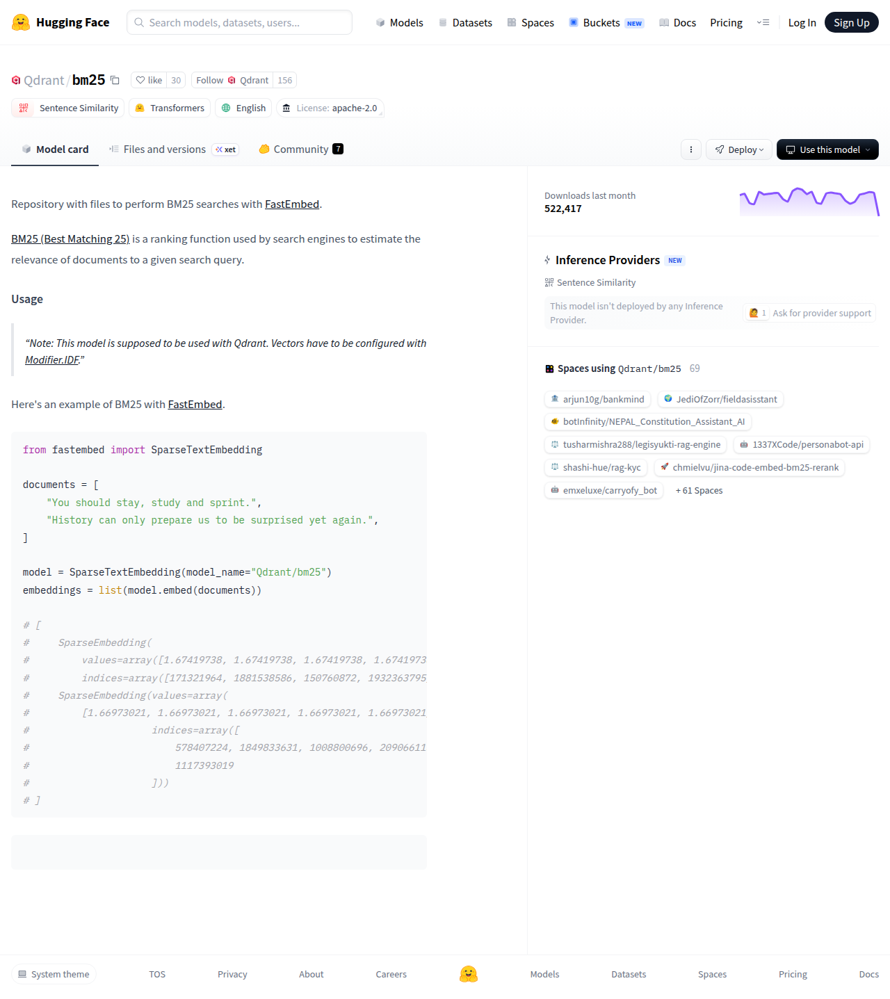

# Visited: https://huggingface.co/Qdrant/bm25
**Time:** Sat May  9 04:14:45 UTC 2026

## Screenshot

## Raw HTML
[page.html](./page.html)

## Downloaded Media (1 files)
## Downloaded Media Files

## Other Links
- [#usage](#usage)
- [/](/)
- [/Qdrant](/Qdrant)
- [/Qdrant/bm25](/Qdrant/bm25)
- [/Qdrant/bm25/colab](/Qdrant/bm25/colab)
- [/Qdrant/bm25/discussions](/Qdrant/bm25/discussions)
- [/Qdrant/bm25/kaggle](/Qdrant/bm25/kaggle)
- [/Qdrant/bm25/tree/main](/Qdrant/bm25/tree/main)
- [/Qdrant/bm25?library=transformers](/Qdrant/bm25?library=transformers)
- [/datasets](/datasets)
- [/docs](/docs)
- [/enterprise](/enterprise)
- [/front/build/kube-87b6ff9/style.css](/front/build/kube-87b6ff9/style.css)
- [/huggingface](/huggingface)
- [/join](/join)
- [/js/script.js](/js/script.js)
- [/login](/login)
- [/models](/models)
- [/models?language=en](/models?language=en)
- [/models?library=transformers](/models?library=transformers)
- [/models?pipeline_tag=sentence-similarity](/models?pipeline_tag=sentence-similarity)
- [/pricing](/pricing)
- [/privacy](/privacy)
- [/spaces](/spaces)
- [/spaces/1337XCode/personabot-api](/spaces/1337XCode/personabot-api)
- [/spaces/JediOfZorr/fieldasisstant](/spaces/JediOfZorr/fieldasisstant)
- [/spaces/arjun10g/bankmind](/spaces/arjun10g/bankmind)
- [/spaces/botInfinity/NEPAL_Constitution_Assistant_AI](/spaces/botInfinity/NEPAL_Constitution_Assistant_AI)
- [/spaces/chmielvu/jina-code-embed-bm25-rerank](/spaces/chmielvu/jina-code-embed-bm25-rerank)
- [/spaces/emxeluxe/carryofy_bot](/spaces/emxeluxe/carryofy_bot)
- [/spaces/huggingface/InferenceSupport/discussions/1911](/spaces/huggingface/InferenceSupport/discussions/1911)
- [/spaces/shashi-hue/rag-kyc](/spaces/shashi-hue/rag-kyc)
- [/spaces/tusharmishra288/legisyukti-rag-engine](/spaces/tusharmishra288/legisyukti-rag-engine)
- [/storage](/storage)
- [/tasks/sentence-similarity](/tasks/sentence-similarity)
- [/terms-of-service](/terms-of-service)
- [https://apply.workable.com/huggingface/](https://apply.workable.com/huggingface/)
- [https://cdnjs.cloudflare.com/ajax/libs/KaTeX/0.12.0/katex.min.css](https://cdnjs.cloudflare.com/ajax/libs/KaTeX/0.12.0/katex.min.css)
- [https://de5282c3ca0c.edge.sdk.awswaf.com/de5282c3ca0c/526cf06acb0d/challenge.js](https://de5282c3ca0c.edge.sdk.awswaf.com/de5282c3ca0c/526cf06acb0d/challenge.js)
- [https://en.wikipedia.org/wiki/Okapi_BM25](https://en.wikipedia.org/wiki/Okapi_BM25)
- [https://fonts.googleapis.com/css2?family=IBM+Plex+Mono:wght@400;600;700&display=swap](https://fonts.googleapis.com/css2?family=IBM+Plex+Mono:wght@400;600;700&display=swap)
- [https://fonts.googleapis.com/css2?family=Source+Sans+Pro:ital,wght@0,200;0,300;0,400;0,600;0,700;1,200;1,300;1,400;1,600;1,700&display=swap](https://fonts.googleapis.com/css2?family=Source+Sans+Pro:ital,wght@0,200;0,300;0,400;0,600;0,700;1,200;1,300;1,400;1,600;1,700&display=swap)
- [https://fonts.gstatic.com](https://fonts.gstatic.com)
- [https://github.com/qdrant/fastembed](https://github.com/qdrant/fastembed)
- [https://huggingface.co/Qdrant/bm25](https://huggingface.co/Qdrant/bm25)
- [https://huggingface.co/docs/inference-providers](https://huggingface.co/docs/inference-providers)
- [https://qdrant.tech/documentation/concepts/indexing/?q=modifier#idf-modifier](https://qdrant.tech/documentation/concepts/indexing/?q=modifier#idf-modifier)

## Stats
- Links: 49
- Media: 1
